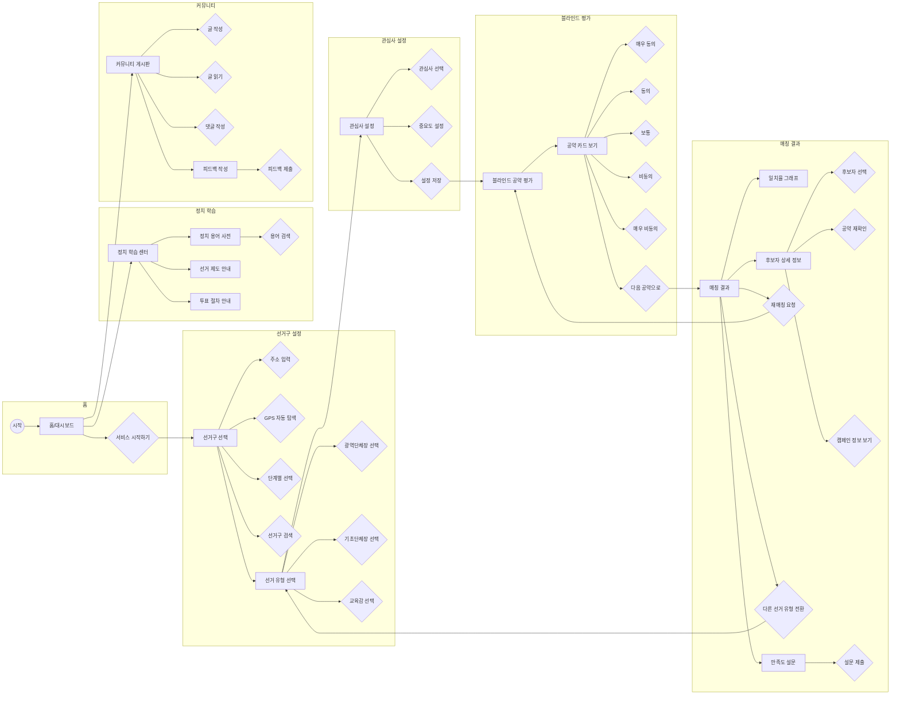

```mermaid
flowchart LR

  subgraph s1 ["홈"]
    n1(("시작"))
    n2["홈/대시보드"]
    n3{"서비스 시작하기"}
  end

  subgraph s2 ["선거구 설정"]
    n4["선거구 선택"]
    n5{"주소 입력"}
    n6{"GPS 자동 탐색"}
    n7{"단계별 선택"}
    n8{"선거구 검색"}
    n9["선거 유형 선택"]
    n10{"광역단체장 선택"}
    n11{"기초단체장 선택"}
    n12{"교육감 선택"}
  end

  subgraph s3 ["관심사 설정"]
    n13["관심사 설정"]
    n14{"관심사 선택"}
    n15{"중요도 설정"}
    n16{"설정 저장"}
  end

  subgraph s4 ["블라인드 평가"]
    n17["블라인드 공약 평가"]
    n18["공약 카드 보기"]
    n19{"매우 동의"}
    n20{"동의"}
    n21{"보통"}
    n22{"비동의"}
    n23{"매우 비동의"}
    n24{"다음 공약으로"}
  end

  subgraph s5 ["매칭 결과"]
    n25["매칭 결과"]
    n26["일치율 그래프"]
    n27["후보자 상세 정보"]
    n28{"후보자 선택"}
    n29{"공약 재확인"}
    n30{"캠페인 정보 보기"}
    n31{"재매칭 요청"}
    n32{"다른 선거 유형 전환"}
    n33["만족도 설문"]
    n34{"설문 제출"}
  end

  subgraph s6 ["정치 학습"]
    n35["정치 학습 센터"]
    n36["정치 용어 사전"]
    n37{"용어 검색"}
    n38["선거 제도 안내"]
    n39["투표 절차 안내"]
  end

  subgraph s7 ["커뮤니티"]
    n40["커뮤니티 게시판"]
    n41{"글 작성"}
    n42{"글 읽기"}
    n43{"댓글 작성"}
    n44["피드백 작성"]
    n45{"피드백 제출"}
  end

  n1 --> n2
  n2 --> n3
  n3 --> n4
  n4 --> n5
  n4 --> n6
  n4 --> n7
  n4 --> n8
  n4 --> n9
  n9 --> n10
  n9 --> n11
  n9 --> n12
  n9 --> n13
  n13 --> n14
  n13 --> n15
  n13 --> n16
  n16 --> n17
  n17 --> n18
  n18 --> n19
  n18 --> n20
  n18 --> n21
  n18 --> n22
  n18 --> n23
  n18 --> n24
  n24 --> n25
  n25 --> n26
  n25 --> n27
  n27 --> n28
  n27 --> n29
  n27 --> n30
  n25 --> n31
  n25 --> n32
  n25 --> n33
  n33 --> n34
  n2 --> n35
  n35 --> n36
  n36 --> n37
  n35 --> n38
  n35 --> n39
  n2 --> n40
  n40 --> n41
  n40 --> n42
  n40 --> n43
  n40 --> n44
  n44 --> n45
  n31 --> n17
  n32 --> n9
```
